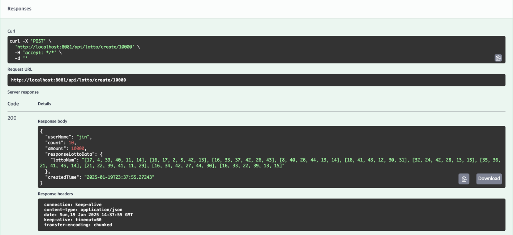
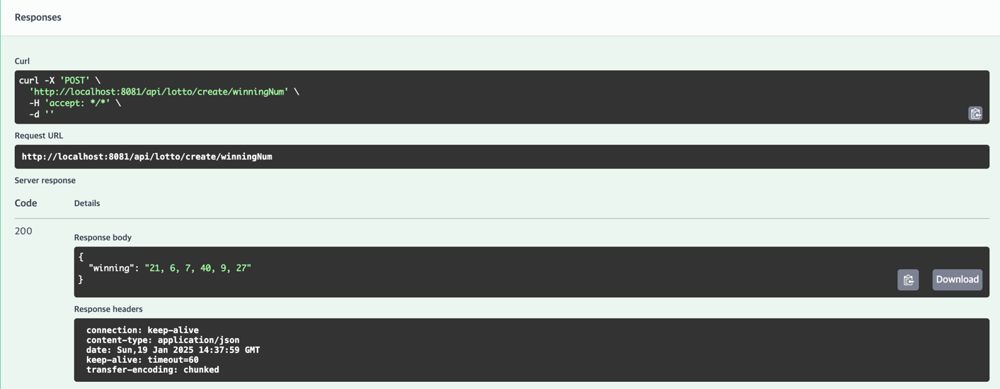
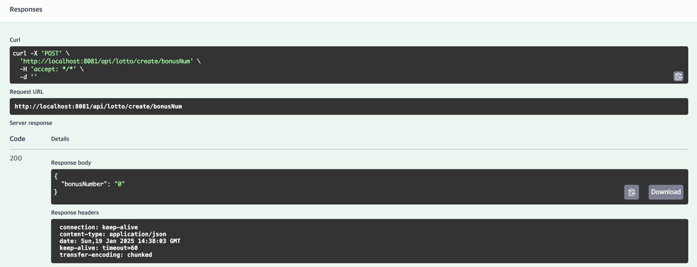
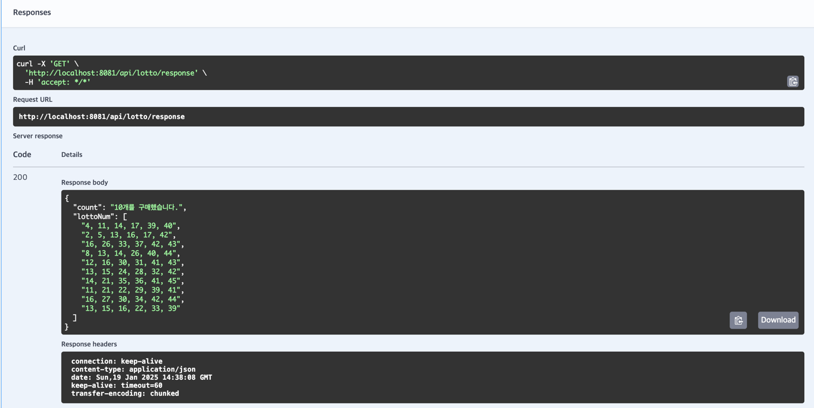
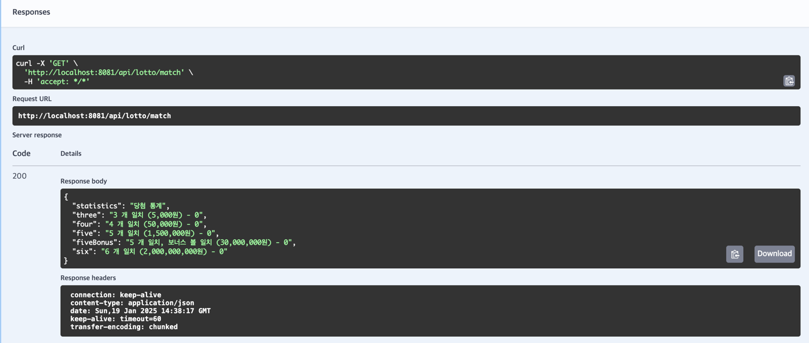
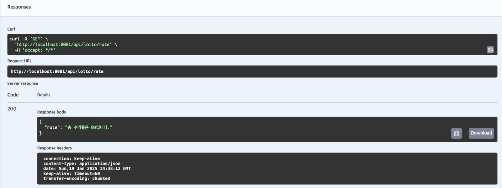

# 3주차 - Lotto

- Swagger : http://localhost:8081/swagger-ui/index.html
- h2-console : http://localhost:8081/h2-console

## 기능 요구사항
#### 정적 요구사항
- 로또 번호의 숫자 범위는 1~45 까지 이다. 
- 1개의 로또를 발행할 때 중복되지 않는 6개의 숫자를 뽑는다
- 당첨번호 추첨 시 중복되지 않는 숫자 6개와 보너스 번호 1개를 뽑는다.
- 로또 1장의 가격은 1,000원
- 로또 구입 금액을 입력시 구입 금액에 해당하는 만큼 로또 발행
- 당첨 번호와 보너스 번호를 입력받는다.
- 내가 구매한 로또와 당첨번호를 비교한다.
- 이번 회차 수익률을 구한다.

 

## 프로그래밍 요구사항
- 인덴트, depth 를 3이 넘지 않도록 구현하자.
- 3항 연산자를 쓰지 않는다.
- 함수가 한가지 일만 하도록 최대한 작게 만들어라
- 단위테스트 코드 작성하기
- 메소드의 길이가 15라인을 넘어가지 않도록 구현한다.
- 함수가 한가지 일만 잘하도록 구현한다.
- else 예약어 사용하지 않는다.
- enum 을 사용하자

 

### 최종 API 실행 순서
1) 로또 구매 -> POST, localhost:8081/api/lotto/create/{amount}
  
2) 로또 당첨 번호 생성 -> POST, localhost:8081/api/lotto/create/winningNum
 
3) 로또 당첨 보너스 번호 생성 -> POST, localhost:8081/api/lotto/create/bonusNum
 
4) 구매한 로또 조회 -> GET, localhost:8081/api/lotto/response
 
5) 로또 당첨 번호 조회 -> GET, localhost:8081/api/lotto/match
 
6) 구매 로또 수익률 조회 -> GET, localhost:8081/api/lotto/rate
